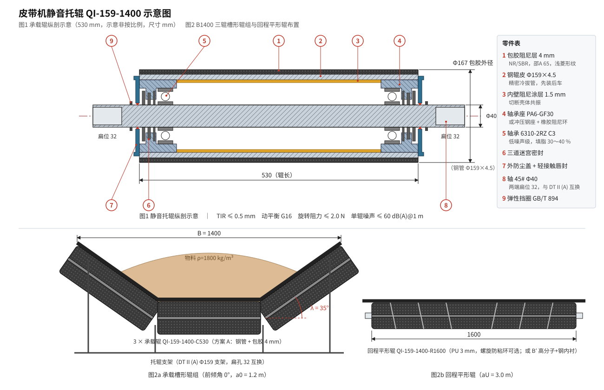

# 皮带机静音托辊设计方案（quiet-idler-v0）

> 状态：**设计方案 v0（概念 + 参数定稿草案）**  
> 基准机型：对齐 **GC-01**（B=1400 mm、Φ159、槽角 35°、v=2 m/s、a0=1.2 m、aU=3.0 m）  
> 口径：DTⅡ(A) 托辊系列尺寸 + GB/T 10595 / JB/T 10200 托辊通用技术条件（具体表值标「待核」处以手册为准）  
> 代号：`QI-159-1400`（Quiet Idler，Φ159，适配 B1400）

---

## 1. 设计目标

| 项 | 目标 | 说明 |
|----|------|------|
| 单辊自由旋转噪声 | **≤ 60 dB(A)** @ 1 m，n 对应 v=2 m/s | 普通钢托辊典型 68～75 dB(A)，目标降 ≥ 10 dB(A) |
| 整线托辊群噪声 | 距机侧 1 m，比普通钢托辊线 **降 8～12 dB(A)** | 现场验收口径 |
| 旋转阻力 | **≤ 2.0 N**（Φ159，新辊） | 低于 GB/T 10595 Φ159 限值（待核） |
| 径向圆跳动 TIR | **≤ 0.5 mm** | 跳动是胶带拍击噪声主因之一 |
| 动平衡 | **G16**（ISO 1940/GB/T 9239） | 普通托辊常不做动平衡 |
| 轴向窜动 | ≤ 0.5 mm | |
| 密封防尘防水 | IP 等级等效 **IP66**；多级迷宫 + 唇封 | 高炉上料多尘潮湿（GC-01 f=0.023 工况） |
| 寿命 | L10 ≥ 50 000 h（承载中辊，额定载荷） | |
| 工作温度 | −30 ℃～+70 ℃ | 包胶 / 高分子材料限制 |
| 互换性 | 安装尺寸、轴端扁位与 DTⅡ(A) Φ159 托辊 **完全互换** | 可对既有线路直接换装 |

---

## 2. 噪声来源与对策（设计依据）

| 序 | 噪声机理 | 典型表现 | 对策（本方案） |
|----|----------|----------|----------------|
| 1 | 钢辊皮壳体共振（“钟鸣”） | 中高频啸叫，单辊 1～4 kHz | 辊皮外包 **阻尼橡胶层**；钢管壁内侧**阻尼涂层/内衬**切断共振 |
| 2 | 辊皮跳动 → 胶带周期拍击 | 低频“哒哒”声，与转速同步 | TIR ≤ 0.5 mm；精密冷拔管；两端轴承座压装后**整体精车外圆** |
| 3 | 轴承滚动噪声 | 中频沙沙声 | 低噪声级轴承（振动 V2/Z2）、C3 游隙、合适填脂量 30～40 % |
| 4 | 密封摩擦 | 吱吱声、阻力上升 | 非接触迷宫为主，单道轻接触唇封为辅 |
| 5 | 辊皮—胶带粘滑（stick-slip） | 间歇尖叫 | 包胶面硬度 **邵 A 65±5**、菱形/人字形浅纹，避免光面 |
| 6 | 结构件传声 | 机架嗡鸣 | 轴承座与轴之间加**橡胶阻尼衬套**；托辊支架安装面加阻尼垫（线路侧，可选） |
| 7 | 不平衡激振 | 转速频率振动 | G16 动平衡，去重在辊皮内壁 |

---

## 3. 总体结构

> 源文件：[`docs/images/quiet_idler_schematic.svg`](./images/quiet_idler_schematic.svg)（示意，非按比例；图1 零件编号与下文「组成件」一致）

组成件（自外向内，编号对应图1）：

1. **包胶阻尼层**：硫化包胶，厚 4 mm，邵 A 65±5，浅菱形纹；回程辊可改 **聚氨酯 3 mm**（耐磨、防粘料）  
2. **钢辊皮**：Φ159×4.5 精密冷拔焊管（GB/T 3639 / GB/T 3091），直线度 ≤ 0.3 mm/m  
3. **内壁阻尼**：水性阻尼浆喷涂 1.5 mm（或 PE 内衬管），阻尼比 η ≥ 0.1；可降壳体共振峰 6～10 dB  
4. **轴承座**：首选 **PA6+GF30 注塑轴承座**（自阻尼、绝缘、耐腐蚀）；重载承载中辊可选 **冲压钢座 + 橡胶阻尼环**  
5. **轴承**：6310-2RZ C3，低噪声级（V2/Z2），锂基润滑脂 2 号，填脂 30～40 %  
6. **密封**：三道迷宫（内迷宫—轴承—外迷宫）+ 外防尘盖 + 单道轻接触唇封（唇口朝外）  
7. **轴**：45# 调质，Φ40，两端铣扁 32 mm（与 DTⅡ(A) Φ159 托辊支架扁孔互换），轴中段可减径至 Φ35 减重（待校核）  
8. **轴端弹性挡圈**：GB/T 894，防轴向窜动  

---

## 4. 主要尺寸与规格（适配 B1400）

### 4.1 承载槽形辊组（3 辊，λ=35°）

| 项 | 数值 | 来源/备注 |
|----|------|-----------|
| 辊径 D | Φ159（包胶后 **Φ167**） | 与 GC-01 一致；包胶后外径变大，支架高度核对见 §7 |
| 单辊长 | 530 mm | GB/T 10595 B1400 三辊槽形辊长（待核） |
| 轴径 | Φ40 | Φ159 重型系列 |
| 轴承 | 6310-2RZ C3 | 低噪声级 |
| 槽角 λ | 35° | |
| 前倾角 | 0°（静音辊**不建议**前倾） | GC-01 原 1°29′；前倾增加滑擦噪声与阻力 Fε，换装后需复算 FS1，见 §6 |
| 单辊质量（估） | 钢辊皮 9.1 + 包胶 1.25 + 轴/轴承/座 ≈ 3.5 → **≈ 13.9 kg** | 普通钢辊约 12.6 kg |
| 相对普通钢辊增重 | 每辊 ≈ **+1.25 kg**（包胶层），每组 ≈ +3.75 kg | 对应 qRO 修正见 §6 |

### 4.2 回程平形辊

| 项 | 数值 | 备注 |
|----|------|------|
| 辊径 | Φ159（包胶后 Φ165，聚氨酯 3 mm） | |
| 辊长 | 1600 mm | GB/T 10595 B1400 平形回程辊长（待核） |
| 轴径 | Φ40 | 长辊挠度控制 |
| 包覆 | 聚氨酯 3 mm，邵 A 85，**螺旋防粘环**可选 | 回程面粘料是回程噪声和跑偏源 |
| 轴承 | 6310-2RZ C3 | |

### 4.3 两种辊皮方案对比（供选型）

| 方案 | 结构 | 单辊质量（530 mm） | 降噪 | 承载能力 | 适用 |
|------|------|-------------------|------|----------|------|
| **A 钢管 + 包胶 + 内阻尼**（推荐承载） | Φ159×4.5 钢 + 4 mm 橡胶 | ≈ 13.9 kg | 8～12 dB(A) | 与普通钢辊相同 | 承载辊、受料段、重载 |
| B 高分子辊皮（UHMWPE/HDPE 厚 8 mm） | 全高分子，无钢管 | ≈ 5.4 kg | 10～15 dB(A) | 中辊 ≤ 1.5 kN（挠度限制） | 轻载回程、短辊 |
| B′ 高分子 + 钢内衬 | HDPE 外 6 mm + 钢 Φ140×3 | ≈ 10.3 kg | 10～13 dB(A) | 接近 A | 回程 1600 mm 长辊 |

GC-01 中辊承载估算：\((q_G+q_B)\,g\,a_0=(236.1+47.6)\times9.81\times1.2\approx3339\ \text{N}\)，中辊按 ≈ 65～70 % 承担 ≈ **2.2～2.3 kN** → 方案 B 不满足，**承载辊采用方案 A**；回程辊载荷 \(q_B g a_U=47.6\times9.81\times3.0\approx1401\ \text{N}\)，可选 **A 或 B′**。

---

## 5. 关键工艺要求（决定能否“静音”）

1. **先装后车**：钢管两端压装轴承座后，以轴承内孔为基准**整体精车外圆**，再硫化包胶，包胶后再磨外圆 → TIR ≤ 0.5 mm  
2. **动平衡**：包胶后做 G16 动平衡，去重点在辊皮内壁两端  
3. **轴承装配**：压装力只作用于内圈；轴承座孔与轴承外圈配合 H7/h6（PA6 座按注塑件公差补偿）  
4. **填脂量**：30～40 %；过量会升温、增阻并产生“搅拌音”  
5. **包胶**：硫化结合强度 ≥ 8 N/mm（GB/T 7760），不得有气泡、脱层；表面纹深 0.8～1.2 mm  
6. **内阻尼层**：喷涂前除油喷砂 Sa2.5；厚度均匀性 ±0.3 mm，避免引入新的不平衡  
7. **出厂检验**（每批抽检 ≥ 5 %）：旋转阻力、TIR、轴向窜动、噪声（§8）、防水（喷淋 30 min 内部无水）  

---

## 6. 对张力 / 功率计算的影响（与 PIDM 计算链衔接）

静音托辊改变 **qRO、qRU、f（局部）、FS1（前倾项）**，需在计算中可追溯。

### 6.1 线密度修正（GC-01 基准）

| 项 | 普通钢辊（GC-01 锚定） | 静音辊 QI-159-1400 | 变化 |
|----|------------------------|--------------------|------|
| qRO | 29.1 kg/m | ≈ 29.1 + 3×1.25/1.2 ≈ **32.2 kg/m** | +3.1 kg/m（包胶增重） |
| qRU（回程方案 A，PU 3 mm） | 10 kg/m | ≈ 10 + 2.9/3.0 ≈ **11.0 kg/m** | +1.0 kg/m |
| qRU（回程方案 B′） | 10 kg/m | ≈ 10 − 6.8/3.0 ≈ **7.7 kg/m** | −2.3 kg/m（高分子替代钢管减重） |

对 FH（式3-19）的影响（承载 A + 回程 A）：\(q_{RO}+q_{RU}+(2q_B+q_G)\cos\delta\) 由 364.9 → 369.0 kg/m，**FH 增加约 1.1 %**（≈ +290 N），在 GC-01 量级下对电机选型无影响，但须在报告「默认值 / 采用值 / 来源」中列出。承载 A + 回程 B′ 时 FH 反而减少约 0.2 %。

### 6.2 模拟摩擦系数 f

包胶辊皮增加压陷阻力，但低阻力轴承与非接触密封减少旋转阻力；两者相抵，v0 **不单独修正 f**，仍按工况表取值（GC-01 0.023）。待实测（§8.3）后，可在 `coeff` 中增加 `f_idler_corr`（建议范围 −0.001～+0.002）。

### 6.3 前倾阻力 Fε

静音辊建议 **取消前倾**（前倾角 0°）：FS1 中的 Fε 项按 0 计。GC-01 回归时如保留 1°29′，则 FS1 维持 6100 N 锚定；换装静音辊方案必须作为**新版本**重算，不得覆盖黄金算例锚定。

### 6.4 字段与系数接口（建议，待落实到 schema / coeff）

| 位置 | 建议新增 | 取值 |
|------|----------|------|
| `Project` (`PATH_INPUT_FIELD_SCHEMA.md`) | `idler_type` | `steel \| quiet_rubber \| quiet_polymer` |
| `Project` | `idler_lagging_mm` | 0 / 3 / 4 |
| `coeff-v0` (`DEFAULT_COEFFICIENTS_V0.md` §3) | qRO / qRU 按 `idler_type` 预置 | 本节表值 |
| 报告 | 「托辊类型」行 + qRO/qRU 来源标注 | 透明计算规则 §7 |
| SW 薄插件 | 设计库草图块 `QI-159-1400-C530` / `QI-159-1400-R1600` | 与 Φ159 标准块同安装尺寸 |

---

## 7. 换装与接口核对

1. **支架扁孔**：32 mm 扁位、Φ40 轴端 → 与 DTⅡ(A) Φ159 支架互换（待核手册支架图）  
2. **包胶后外径 Φ167**：承载面抬高 4 mm；整线统一换装无影响；**混装**时需在过渡处逐步过渡，避免局部点载  
3. **凸弧段**：外径增大对凸弧段胶带与边辊间隙略有影响，核对边辊端部与胶带边距 ≥ 50 mm  
4. **受料段**：受料点改用**缓冲静音辊**（包胶层增至 8～10 mm 缓冲圈），本方案不覆盖，列入后续  
5. **电气**：PA6 轴承座绝缘，若线路要求胶带静电导出，须在支架另设接地刷或改钢座方案  

---

## 8. 试验与验收

### 8.1 单辊噪声（型式试验）

- 依据：GB/T 10595 附录 / ISO 3744 自由场近似  
- 条件：试验台驱动辊皮，线速 2.0 m/s（Φ167 对应 n ≈ 229 r/min），空载与 1.0 kN 径向加载两种  
- 测点：轴向中截面，距辊皮表面 1 m，高 1 m，4 点取均值；A 计权，慢档  
- 判定：**空载 ≤ 60 dB(A)**，加载 ≤ 63 dB(A)；背景噪声低于测值 10 dB(A)

### 8.2 常规性能

| 项 | 方法 | 判定 |
|----|------|------|
| 旋转阻力 | GB/T 10595 旋转阻力法，加载后测 | ≤ 2.0 N |
| TIR | 千分表，辊长方向 3 截面 | ≤ 0.5 mm |
| 轴向窜动 | 千分表 | ≤ 0.5 mm |
| 防水 | 喷淋 30 min / 浸水 1 h | 内部无水 |
| 防尘 | 粉尘箱 24 h | 阻力增量 ≤ 0.5 N |
| 包胶结合 | GB/T 7760 剥离 | ≥ 8 N/mm |

### 8.3 现场对比（接入 PIDM）

- 在 GC-01 同类线路取 20 组承载 + 10 组回程换装，测机侧 1 m 噪声差值  
- 同步记录驱动电流，反算 FH 变化，用于标定 `f_idler_corr`

---

## 9. 待办与风险

| 序 | 事项 | 风险/说明 |
|----|------|-----------|
| 1 | 核 GB/T 10595 / JB/T 10200 关于 Φ159 辊长、旋转阻力、TIR 限值的具体表值 | 本文标「待核」项 |
| 2 | 核 DTⅡ(A) Φ159 托辊支架扁孔与轴端尺寸 | 互换性前提 |
| 3 | 内阻尼涂层高温（+70 ℃）耐久试验 | 涂层老化脱落会引入不平衡 |
| 4 | PA6-GF30 轴承座在 2.3 kN 中辊载荷下蠕变校核 | 不满足则改钢座 + 阻尼环 |
| 5 | 受料段缓冲静音辊 | 单独方案 |
| 6 | `idler_type` 字段与 qRO/qRU 预置写入 schema / coeff 并在 `calc.html` 可选 | 衔接计算链 |

---

## 修订记录

| 日期 | 说明 |
|------|------|
| 2026-10-01 | quiet-idler-v0：目标、噪声对策、结构、B1400 规格、工艺、对计算链影响、试验验收 |
