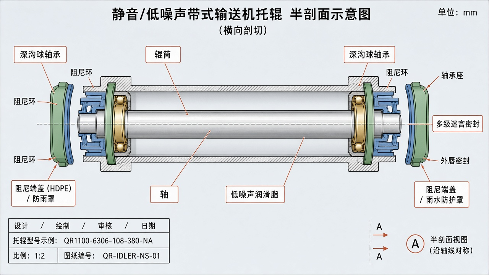
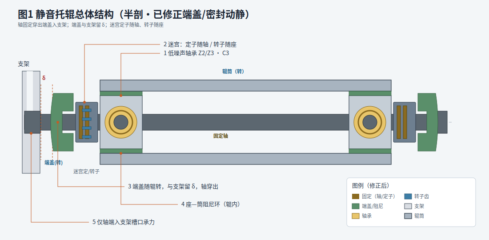
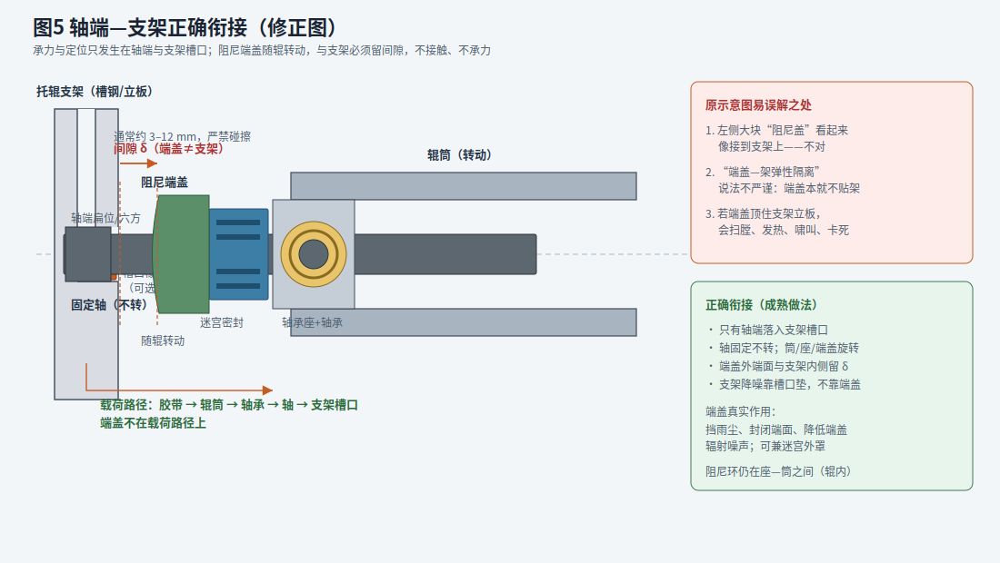
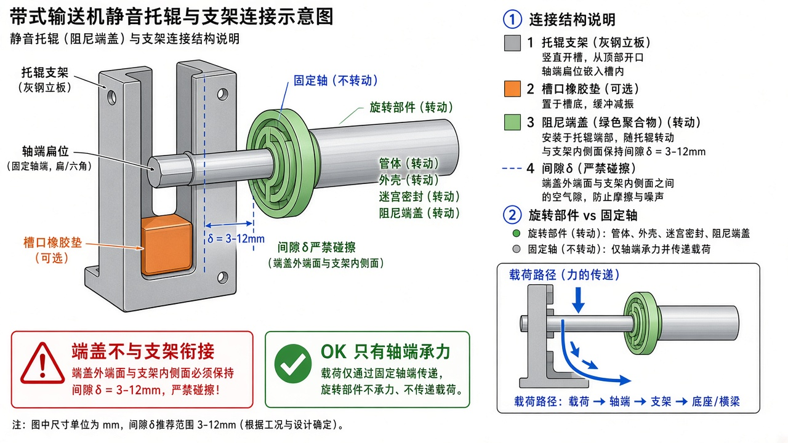
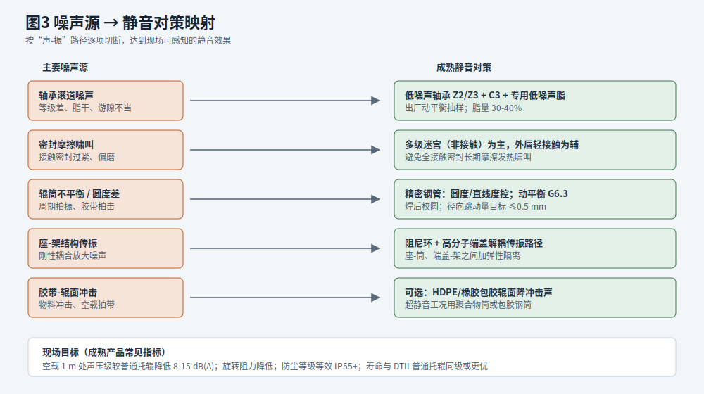
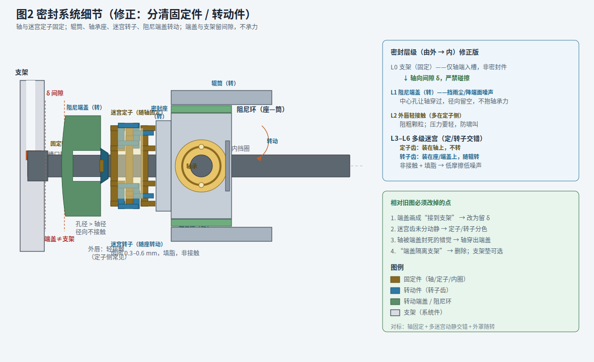
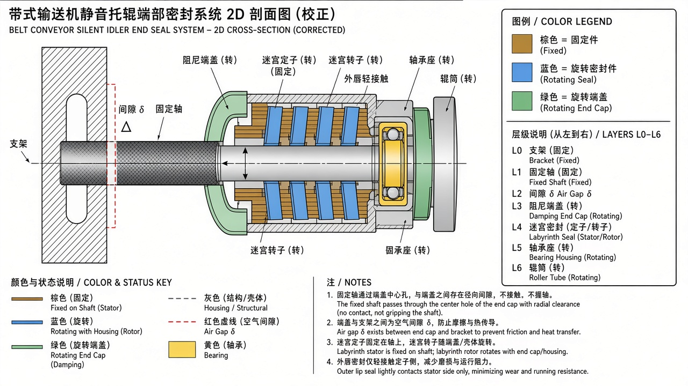
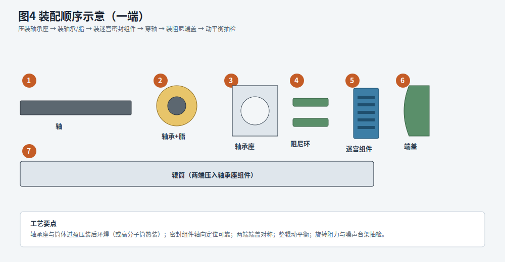

# 皮带机静音托辊 — 成熟结构设计方案

> 对标国际主流托辊厂商（Rulmeca、PPI、Metso、Sandvik 等）已验证的静音/低噪声托辊结构，给出可工程化落地的推荐构型与示意。

---

## 1. 结论：推荐构型

**推荐采用「精密钢筒 + 冲压轴承座 + 低噪声深沟球轴承 + 多级迷宫密封 + 高分子阻尼端盖」复合静音结构。**

这是目前矿山、港口、电厂、水泥等场景中**载荷能力、寿命、成本、可维护性**最均衡、应用最广的成熟方案。超静音或强腐蚀工况可升级为 **HDPE/UHMWPE 聚合物筒** 或 **钢筒包胶** 变体，密封与轴承体系保持不变。

| 方案 | 适用 | 降噪幅度（相对普通钢托辊） | 成熟度 |
|------|------|---------------------------|--------|
| **A. 精密钢筒静音托辊（推荐主型）** | 通用承载/回程 | 约 8～12 dB(A) | ★★★★★ |
| B. 钢筒 + 橡胶/聚氨酯包胶 | 受料点、冲击段 | 约 10～15 dB(A) | ★★★★☆ |
| C. 全聚合物筒静音托辊 | 轻中载、强腐蚀、室内 | 约 12～18 dB(A) | ★★★★☆ |

下文以 **方案 A** 为详细设计对象。

---

## 2. 总体结构





### 2.1 零件组成（一端对称）

| 序号 | 名称 | 材料/规格建议 | 作用 |
|------|------|---------------|------|
| 1 | 轴 | 45# 冷拉圆钢，端头扁位或六方 | 支承、与支架槽钢定位 |
| 2 | 深沟球轴承 | 6204/6205 等，**低噪声级 Z2/Z3**，游隙 **C3** | 低摩擦回转，控制滚道噪声 |
| 3 | 轴承座 | 冷冲压碳钢，精车轴承孔 | 定心、传载 |
| 4 | 阻尼减振环 | NBR / TPE / 聚氨酯 | 切断座—筒刚性振传 |
| 5 | 多级迷宫密封组件 | PA6 / POM + 钢骨架 | **非接触**阻尘，消除密封啸叫 |
| 6 | 外唇密封（轻接触） | 低摩擦 NBR 唇形 | 阻粗颗粒，辅助防尘 |
| 7 | 高分子阻尼端盖 | HDPE / PA | 挡雨尘、降端面辐射噪声；**随辊转，不贴支架** |
| 8 | 辊筒 | 精密 ERW 钢管（Φ89/108/133/159…） | 承载胶带；圆度与动平衡是静音前提 |
| 9 | 润滑脂 | 低噪声锂基脂，NLGI 2 | 填充脂腔与迷宫间隙 |

筒体两端结构对称；中间为脂腔，出厂一次加脂，免维护运行。

---

## 2.2 轴端—支架衔接（重要修正）

> **结论先说：最左侧“阻尼端盖”并不与皮带机支架衔接。**  
> 与支架发生定位/承力的只有**轴端**；端盖若顶到支架立板，结构就是错的。





### 运动与承力分工（成熟通用做法）

| 零件 | 相对支架 | 是否承力 | 说明 |
|------|----------|----------|------|
| 轴（扁位/六方端） | **固定**，落入支架槽口 | **是** | 唯一与支架直接配合的承力件 |
| 轴承内圈 | 随轴固定 | 传载 | 过盈/过渡配在轴上 |
| 轴承外圈 + 轴承座 + 辊筒 | **旋转** | 传载到轴承 | 不接触支架 |
| 迷宫密封 / 阻尼端盖 | **随辊旋转**（常见） | **否** | 端盖外端面与支架内侧必须留间隙 |
| 支架槽口橡胶垫 | 固定在支架上（可选） | 缓冲轴端 | **支架侧**降噪件，不是端盖 |

### 原方案里哪里不靠谱

1. **图示误导**：左侧大块绿色“阻尼盖”画得太靠外、太像接到支架上，容易理解成“端盖顶支架”。  
2. **文字不严谨**：曾写“端盖—架之间加弹性隔离”——端盖正常就**不贴架**，谈不上用端盖去隔离支架；支架侧降噪应靠**槽口垫**。  
3. **若真做成端盖顶支架**：扫膛、发热、啸叫、卡滞，静音反而失败。

### 正确间隙与安装要点

- 端盖（或密封外端面）到支架立板内侧留 **δ ≈ 3～12 mm**（按带宽/支架开档与辊长公差定），运转中不得碰擦。  
- 轴端落入支架开口槽；扁位/六方防转；必要时槽底加 **尼龙/橡胶垫** 降轴端敲击声。  
- 辊长、轴长、支架开档三者按 DTⅡ/厂家配套表匹配，不能只加厚端盖去“凑”开档。  
- 阻尼端盖真实作用：**挡雨尘、封闭端面、降低端面辐射噪声**，并可做迷宫外罩——**不是支承接头**。  
- 辊内 **座—筒阻尼环** 仍然成立（切断筒体金属声传振）；与支架无关。

### 载荷路径（核对用）

```text
胶带 → 辊筒 → 轴承座 → 轴承外圈 → 滚动体 → 轴承内圈 → 轴 → 支架槽口
                                              ↑
                                         端盖不在此路径
```

---

## 3. 静音原理（必须同时满足）

普通托辊噪声主要来自：**轴承滚道声、密封摩擦啸叫、筒体不平衡拍振、座架结构传振、胶带冲击**。成熟静音托辊不是“换个塑料壳”，而是按路径逐项切断：



### 3.1 轴承与润滑

- 选用 **低噪声级** 深沟球轴承（厂商噪声分组 Z2/Z3），禁止混用杂牌高噪声轴承。
- 游隙 **C3**：过小易发热啸叫，过大则滚道冲击声上升。
- 脂量约轴承空间的 **30%～40%**；过多搅油噪声，过少金属干摩擦。
- 轴承与座孔、轴的配合按 H7/k5～js6 控制，避免松动敲击声。

### 3.2 密封系统细节（已按动静件修正）





#### 3.2.1 谁转、谁不转（密封区必须画对）

| 零件 | 状态 | 装配关系 |
|------|------|----------|
| 轴、迷宫**定子**齿、轴承内圈 | **固定** | 定子装在轴上（挡圈/过盈/卡簧定位） |
| 辊筒、轴承座、密封座、迷宫**转子**齿、阻尼端盖 | **转动** | 转子/端盖随轴承座或外罩转动 |
| 支架 | **固定（系统件）** | 只接轴端；与端盖有轴向间隙 δ |

关键几何：

- 轴从端盖中心孔**穿出**落到支架槽口；端盖孔径 **>** 轴径，**径向不抱轴、不承力**。  
- 端盖外端面与支架立板内侧留 **δ ≈ 3～12 mm**，运转不得碰擦。  
- 迷宫定子齿与转子齿交错，齿间 **0.3～0.6 mm**，填脂，**非接触**。

#### 3.2.2 密封层级（由外 → 内）

| 层级 | 名称 | 动静 | 作用 |
|------|------|------|------|
| L0 | 支架槽口 | 固定 | 非密封件；仅轴端承力定位 |
| — | 轴向间隙 δ | — | 端盖与支架隔离，防扫膛 |
| L1 | 阻尼端盖 | **转** | 挡雨尘、降端面辐射噪声；可兼迷宫外罩 |
| L2 | 外唇轻接触 | 多为定子侧 | 阻粗颗粒；接触压力要轻，防啸叫 |
| L3–L6 | 多级迷宫 | 定/转子交错 | 主密封；非接触 + 脂障，低摩擦低噪声 |
| L7 | 轴承内挡圈/防尘盖 | — | 保护脂腔 |

```text
支架 |δ| 端盖(转) → 外唇(轻接触) → 迷宫定子(固定) ╳ 迷宫转子(转) → 轴承 → 辊筒
      ↑
   只允许轴穿过；端盖不顶支架
```

#### 3.2.3 相对旧密封图的修正点

1. 端盖不再画成接到支架 → **改为留 δ**。  
2. 迷宫齿必须分色：**定子（随轴）/ 转子（随座）**。  
3. 轴不被端盖“封死” → **轴穿出端盖**再入支架槽。  
4. 删除“端盖隔离支架”表述；支架降噪用**槽口垫**（可选）。  

> 全接触多唇密封在粉尘工况下短期密封好，但易发热、啸叫、寿命短，**不宜作为静音主方案**。主密封必须是非接触迷宫。

### 3.3 几何与动平衡

| 项目 | 建议目标 |
|------|----------|
| 辊筒外圆径向跳动 | ≤ 0.5 mm（精密级可 ≤ 0.3 mm） |
| 筒体圆度 / 直线度 | 按精密托辊管标准；焊后校圆 |
| 动平衡 | G6.3（高速或超静音可 G2.5） |
| 两端轴承座同轴度 | 严格控制，避免偏磨与周期噪声 |

### 3.4 阻尼解耦（分清辊内 / 支架侧）

- **辊内**：轴承座与筒体之间加 **弹性阻尼环**（或阻尼涂料/衬套），降低筒体金属声。  
- **端面**：高分子端盖降低端面辐射噪声、挡雨尘；**端盖不接触支架**。  
- **支架侧（系统级，可选）**：支架槽口与轴端之间加橡胶/尼龙垫，降低轴端敲击声——这才是“与支架衔接处”的降噪点。

---

## 4. 推荐尺寸系列（与 DTⅡ 常用规格对齐）

| 辊径 D (mm) | 常用轴承 | 轴径 (mm) | 典型带宽配套 | 备注 |
|-------------|----------|-----------|--------------|------|
| 89 | 6204 | 20 | B500～B800 | 轻载回程 |
| 108 | 6204/6205 | 20/25 | B650～B1000 | 常用 |
| 133 | 6305/6205 | 25 | B800～B1400 | 常用承载 |
| 159 | 6306 | 30 | B1000～B1600 | 重载 |
| 194 | 6308 | 40 | B1400～B2000 | 重载长运距 |

槽形组、调心组、缓冲组可共用同一端盖密封模块，仅改筒长、壁厚与轴承规格。

---

## 5. 装配流程



1. 精车/冲压轴承座，压入（或焊接）阻尼环定位面。  
2. 轴承涂脂后压入轴承座。  
3. 组装迷宫密封组件与外唇，形成端盖密封模块。  
4. 模块压入精密钢管两端，环焊（钢筒）或热装（聚合物筒）。  
5. 穿轴、轴向定位挡圈。  
6. 扣装高分子阻尼端盖（保证轴端外露长度足够落入支架槽口，端盖外端面相对轴肩/轴端有正确轴向位置）。  
7. 整辊动平衡；抽检旋转阻力与噪声台架。  
8. 上架检查：轴端入槽到位，端盖与支架立板有间隙、无碰擦。

---

## 6. 变体选型指引

### 6.1 方案 B：包胶静音托辊

- 在方案 A 钢筒外硫化 **橡胶或聚氨酯包胶**（厚 8～15 mm）。
- 优先用于 **受料点缓冲托辊**、落差大冲击段。
- 注意包胶均匀性，否则反而引入新的不平衡噪声。

### 6.2 方案 C：聚合物筒静音托辊

- 筒体：HDPE / UHMWPE / 尼龙改性，一体注塑或管材机加。
- 轴承与迷宫密封体系与方案 A 相同。
- 优点：本质阻尼好、耐腐蚀、更静音；缺点：高温、重载、尖角物料场合承载力与耐磨不如钢筒。

---

## 7. 验收与台架指标（工程可检）

| 项目 | 建议指标 |
|------|----------|
| 空载噪声（1 m，半消声或对比法） | 较同规格普通托辊低 **≥ 8 dB(A)** |
| 旋转阻力 | 不高于同规格优质托辊；优选更低 |
| 防水防尘 | 淋水/粉尘箱试验后旋转阻力无明显上升 |
| 轴向窜动 / 径向跳动 | 符合企业精密托辊标准 |
| 寿命 | 与同规格 DTⅡ 优质托辊同级（密封失效前） |

---

## 8. 设计要点清单（落地检查）

- [ ] 轴承是否明确 **低噪声级 + C3**  
- [ ] 密封是否为 **多级迷宫为主**（非全接触堆叠）  
- [ ] 迷宫是否分清 **定子（随轴）/ 转子（随座）**  
- [ ] 端盖是否随辊转、轴是否穿出、与支架是否有 δ  
- [ ] 是否有 **阻尼端盖 / 座—筒阻尼环**  
- [ ] 筒体是否有 **跳动与动平衡** 要求  
- [ ] 脂型、脂量是否写入工艺文件  
- [ ] 轴端与支架槽口配合正确（扁位/六方入槽）  
- [ ] 端盖与支架立板有间隙，**无碰擦**  
- [ ] 需要时支架槽口是否加缓冲垫（支架侧，非端盖）  
- [ ] 受料点是否评估升级包胶或聚合物筒  

---

## 9. 示意图索引

| 图号 | 文件 | 内容 |
|------|------|------|
| 图1 | [`figures/01-overall-section.svg`](./figures/01-overall-section.svg) · [PNG](./figures/01-overall-section.png) | 总体半剖结构（矢量示意） |
| 图1b | [`figures/silent-idler-overall-schematic.jpg`](./figures/silent-idler-overall-schematic.jpg) | 总体半剖效果图 |
| 图2 | [`figures/02-seal-detail.svg`](./figures/02-seal-detail.svg) · [PNG](./figures/02-seal-detail.png) | **密封系统细节（修正：分清动静件）** |
| 图2b | [`figures/silent-idler-seal-detail.jpg`](./figures/silent-idler-seal-detail.jpg) | 密封细节效果图（修正） |
| 图3 | [`figures/03-noise-map.svg`](./figures/03-noise-map.svg) · [PNG](./figures/03-noise-map.png) | 噪声源—对策映射 |
| 图4 | [`figures/04-assembly.svg`](./figures/04-assembly.svg) · [PNG](./figures/04-assembly.png) | 装配顺序 |
| 图5 | [`figures/05-bracket-interface.svg`](./figures/05-bracket-interface.svg) · [PNG](./figures/05-bracket-interface.png) | **轴端—支架衔接（修正）** |
| 图5b | [`figures/idler-bracket-interface-correction.jpg`](./figures/idler-bracket-interface-correction.jpg) | 衔接效果示意 |

---

## 10. 与本项目的关系

本方案可作为 PIDM / DTⅡ 托辊选型中的 **「静音托辊」结构说明与参数依据**；计算侧仍使用既有 `qRO` / `qRU` 等线密度，静音型若自重有变化，在选型表中单独给出旋转部件质量即可。
