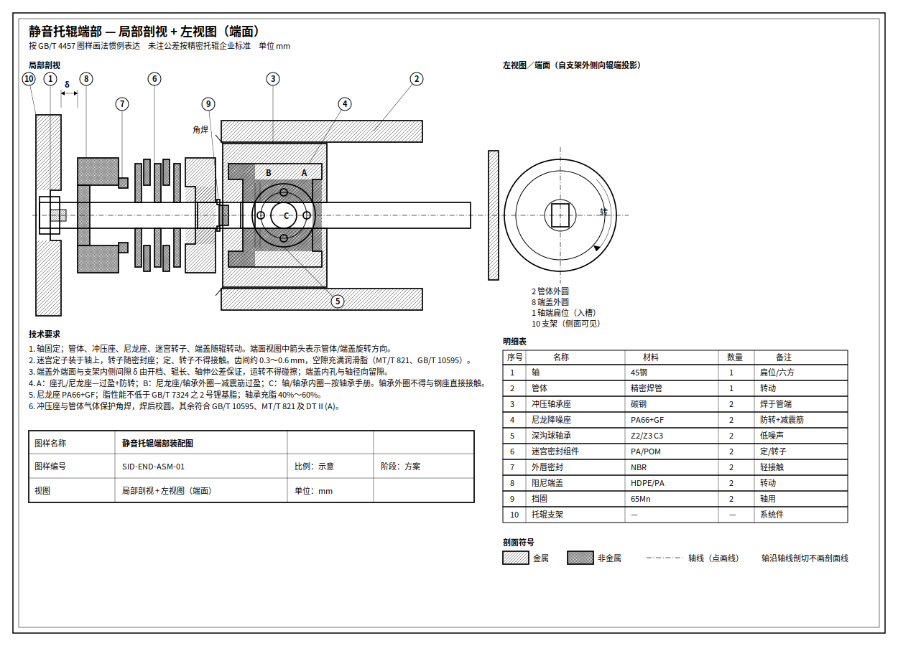

# 完善版静音托辊方案（甲乙融合）

> 将两种形式合并为一套可落地结构：  
> **甲**＝冲压轴承座 + **PA66 尼龙降噪座**软隔振；  
> **乙**＝轴固定入支架、端盖留间隙 δ、迷宫定/转子分清。  
> 并**纠正甲图迷宫动静标注错误**。

参考原图：

| 来源 | 文件 |
|------|------|
| 甲：尼龙降噪座方案 | [`figures/ref-nylon-seat-scheme.png`](./figures/ref-nylon-seat-scheme.png) |
| 乙：密封/支架修正方案 | [`figures/ref-seal-bracket-corrected.png`](./figures/ref-seal-bracket-corrected.png) |
| **完善版工程图（剖视+端面）** | [`figures/07-end-drawing-gb.png`](./figures/07-end-drawing-gb.png) · [`figures/06-integrated-end.png`](./figures/06-integrated-end.png) |
| 概念效果图（非制图） | [`figures/silent-idler-integrated-end.jpg`](./figures/silent-idler-integrated-end.jpg) |

出处分级见 [`REFERENCES.md`](./REFERENCES.md)。

---

## 1. 一句话结论

**推荐构型：**

> 精密管体 + 冲压钢轴承座（焊管）+ **PA66 尼龙降噪座（轴承外圈软隔振）** + 低噪声深沟球轴承（Z2/Z3、C3）+ **多级迷宫（定子随轴 / 转子随座）** + 外唇轻接触 + **阻尼端盖（随辊转，与支架留 δ）** + 固定轴（扁位/六方入支架槽口）。

钢座保证承力与焊接强度；尼龙座切断「轴承→管体」钢-钢硬传振；密封与支架关系按乙方案运动学，避免扫膛。



> 图样按装配图惯例：金属/非金属剖面符号区分、轴线点画线、轴沿轴线剖切不画剖面线、序号球标 + 明细表 + 技术要求。概念着色图仅作辅助，不作为制图依据。

---

## 2. 甲乙各自保留 / 舍弃 / 纠正

| 项目 | 甲方案 | 乙方案 | 完善版 |
|------|--------|--------|--------|
| 冲压轴承座焊管体 | ✅ 保留 | （弱化） | ✅ 承力骨架 |
| PA66 尼龙降噪座 | ✅ 核心 | ❌ 无 | ✅ **核心静音件** |
| 防转凸筋 + 翻边 | ✅ | — | ✅ |
| 内孔减震筋抱轴承 | ✅ | — | ✅ |
| 轴固定、槽口承力 | 未画清 | ✅ | ✅ |
| 端盖—支架间隙 δ | 未画 | ✅ | ✅ |
| 端盖随辊转、径向不抱轴 | 未画清 | ✅ | ✅ |
| 迷宫定子随轴 / 转子随座 | ❌ **图注写反** | ✅ | ✅ **按乙纠正** |
| 外唇轻接触 | 弱 | ✅ | ✅ |
| 槽口橡胶垫 | — | 可选 | 可选（支架侧） |

### 必须纠正的一点（甲图）

甲图图注写「迷宫内圈随轴转动、外圈固定」。  
在散料皮带机通用结构中**轴是固定不转的**，因此：

- 装在轴上的迷宫件＝**定子（不转）**  
- 随轴承座/端盖的迷宫件＝**转子（转）**  

写反会导致装配/采购理解错误。完善版以乙方案运动学为准。

---

## 3. 零件表（一端）

| 序号 | 名称 | 材料/规格 | 动静 | 作用 |
|------|------|-----------|------|------|
| ① | 轴 | 45# 冷拉；端扁位/六方 | 固定 | 唯一与支架承力配合 |
| ② | 管体 | 精密高频焊管 | 转 | 承载胶带；辐射面 |
| ③ | 冲压轴承座 | 冷冲压碳钢 | 转 | 焊于管端；承力骨架 |
| ④ | **尼龙降噪座** | **PA66+GF**（推荐玻纤增强） | 转 | 轴承外圈软隔振；翻边+防转 |
| ⑤ | 深沟球轴承 | 6204/05/06…；**Z2/Z3、C3** | 内圈固定/外圈转 | 回转与噪声源控制 |
| ⑥ | 迷宫密封 | PA/POM 定子+转子多级 | 定/转交错 | 主密封，非接触+满脂 |
| ⑦ | 外唇密封 | 低摩擦 NBR | 轻接触 | 阻粗颗粒 |
| ⑧ | 阻尼端盖 | HDPE/PA | 转 | 挡雨尘、降端面辐射；不贴支架 |
| ⑨ | 挡圈 | 标准轴用挡圈 | — | 轴向定位 |
| ⑩ | 润滑脂 | 2 号锂基（或低噪声脂） | — | 轴承 40～60%；迷宫充满 |
| — | 支架槽口垫 | 尼龙/橡胶 | 固定（支架侧） | 可选；降轴端敲击 |

---

## 4. 配合与装配（A/B/C + 密封）

沿用甲方案配合逻辑，并补齐乙方案几何：

| 代号 | 界面 | 要求 |
|------|------|------|
| **A** | 冲压座孔 ↔ 尼龙座外圆 | 过盈 + **防转凸筋/卡槽**（双保险，防打滑啸叫） |
| **B** | 尼龙座内孔 ↔ 轴承外圈 | **减震筋过盈**；外圈不得与钢座硬接触 |
| **C** | 轴 ↔ 轴承内圈 | 按轴承手册（常用过渡/轻过盈） |
| **δ** | 端盖外端面 ↔ 支架内侧 | **3～12 mm** 量级，按开档/辊长公差核算；严禁碰擦 |
| **径向空** | 端盖内孔 ↔ 轴 | 孔径 > 轴径，不抱轴、不承力 |
| **迷宫** | 定子齿 ↔ 转子齿 | 0.3～0.6 mm 量级非接触；间隙满脂；内外件不得相蹭（MT/T 821） |

### 建议装配顺序（一端）

1. 冲压座压入/定位后与管体 **CO₂ 角焊**，校圆。  
2. 尼龙降噪座压入座孔，**凸筋对准卡槽**，翻边贴紧座口。  
3. 轴承涂脂后压入尼龙座（走减震筋孔）。  
4. 装迷宫定子（轴上）与转子（座/端盖侧）、外唇、挡圈。  
5. 穿轴、两端对称定位。  
6. 扣阻尼端盖；确认轴伸长度满足入槽。  
7. 动平衡；阻力/噪声/密封抽检。  
8. 上架：轴端入槽 + 检查 δ，无碰擦。

---

## 5. 两条路径（设计核对用）

### 5.1 载荷路径（强度）

```text
胶带 → 管体 → 冲压轴承座 → 尼龙降噪座 → 轴承外圈 → 滚动体
     → 轴承内圈 → 轴 → 支架槽口
```

尼龙座在载荷路径上 → 必须用 **玻纤增强 PA66**、足够壁厚与过盈，并按带宽/辊径做静载与蠕变校核。纯未增强尼龙重载易蠕变松旷。

### 5.2 振动/噪声路径（静音）

```text
轴承滚道高频振动 → 尼龙座（阻尼吸收）→ 冲压座 → 管体辐射
```

相对「轴承外圈直接钢抱在冲压座」：完善版在第一步就切断钢-钢硬传，抑制管体“鼓”。  
端面噪声另由阻尼端盖削弱；支架敲击另由槽口垫处理（与端盖无关）。

---

## 6. 可靠性风险与对策

| 风险 | 后果 | 对策 |
|------|------|------|
| 尼龙座防转失效 | 座内打滑、啸叫、发热 | 凸筋+过盈；材料 PA66+GF；抽检扭矩 |
| 尼龙蠕变 | 轴承松动、跳动变大 | 玻纤增强；控制温升；重载加厚壁 |
| 高温（>80～100℃） | 尼龙软化 | 改 PPS/特种工程塑料或退回钢座+阻尼环方案 |
| 端盖顶支架 | 扫膛、啸叫、卡死 | 强制 δ；辊长/轴长/开档联表 |
| 迷宫动静装反 | 密封失效或干涉 | 工艺图分色：定子随轴、转子随座 |
| 脂量不足/污染 | 轴承噪声与寿命差 | 按 GB/T 10595 充脂；清洁装配 |
| 冲击受料 | 尼龙座过载 | 受料点用包胶缓冲辊，端部模块可不变 |

---

## 7. 与前版方案的关系

| 前版说法 | 完善版 |
|----------|--------|
| 座—筒之间简单阻尼环 | **升级为 PA66 降噪座**（隔振更直接，作用在轴承外圈） |
| 阻尼端盖“隔离支架” | **废弃**；端盖不贴架，支架侧另加槽口垫 |
| 迷宫未分动静 / 甲图写反 | **统一为定子随轴、转子随座** |
| 仅概念静音 | 给出 A/B/C、δ、材料、装配、风险表，可进入详设 |

尺寸系列、验收台架仍见 [`DESIGN.md`](./DESIGN.md) §4、§7；出处见 [`REFERENCES.md`](./REFERENCES.md)。

---

## 8. 选型速查

| 工况 | 建议 |
|------|------|
| 一般散料、常温 | **本完善版（默认）** |
| 噪声敏感区（GB 50431） | 本版 + 低噪声轴承/脂 + 动平衡加严 |
| 受料冲击 | 本版端部 + 包胶管体 |
| 强腐蚀/轻中载 | 可评估聚合物管体，端部仍用本密封+尼龙座逻辑 |
| 高温/重载极限 | 校核尼龙座；必要时钢座硬抱 + 阻尼环退阶方案 |

---

## 9. 检查清单（详设/采购）

- [ ] 图样标明：轴固定；迷宫定子/转子分色  
- [ ] 尼龙座：PA66+GF、翻边、防转、减震筋；轴承外圈不碰钢座  
- [ ] 冲压座—管体焊接与同轴度要求  
- [ ] 端盖与支架 δ、轴伸入槽长度  
- [ ] 充脂量符合 GB/T 10595；迷宫满脂  
- [ ] 轴承品牌/噪声级/游隙写入 BOM  
- [ ] 台架：阻力、噪声对比、防尘/淋水（可对标 MT/T 821）  
- [ ] 温域与载荷校核尼龙座蠕变  
